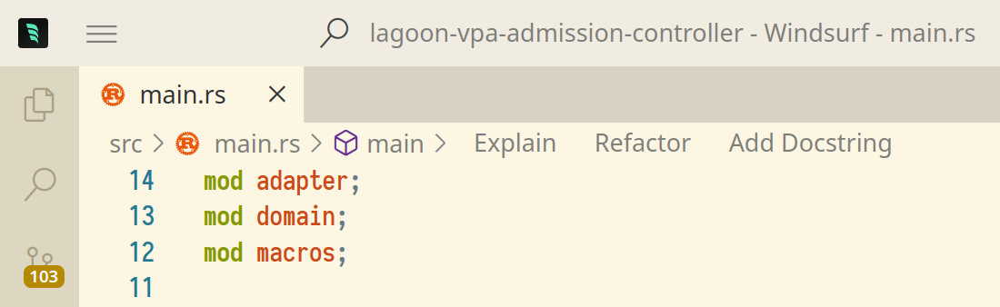
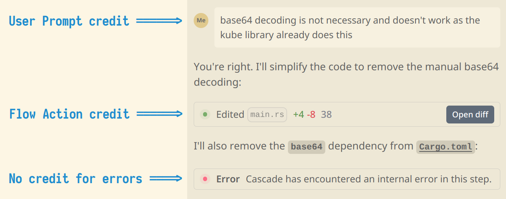

<!-- .slide: class="master-cover" -->

## AI & Agentic powered IDEs

<br/>

### Tech Kafi <br>15.4.2025
### Daniel Tschan
<!-- .element style="margin-bottom: 12rem" --->

-*-*-

## Names and Brands

<div>

* Exafunction: Company behind Windsurf
* Codeium: Former brand for IDE plugins
* Windsurf: New brand for IDE plugins and agentic IDE
* Windsurf Editor: Agentic IDE based on Visual Studio Code
* Cascade: Coding workflow agent in Windsurf editor/plugins

</div>
<!-- .element style="font-size: 0.85em;" --->

-*-*-

## Puzzle Coding AI Strategy


* Gain experience with tools available today
* Exchange our experiences
* Use tools consciously
* Mid-term: standardize on few tools and check hosting options
  * Minimize dependencies and costs

-*-*-

## Legal Situation

<div>

* Caution with permissively licensed open source projects
    * BSD, Apache, MIT, ...
* Coding AIs may generate Copyleft licensed code
    * Not compatible with permissive licenses
* For other projects, we currently view legal risk as negligible

</div>
<!-- .element style="font-size: 0.85em;" --->

[More information](https://www.bloomberglaw.com/external/document/X4H9CFB4000000/copyrights-professional-perspective-ip-issues-with-ai-code-gener)
<!-- .element style="font-size: 0.85em;" --->

-*-*-

## Order Coding AI Licenses

* Get ok for AI usage from customers
* Remove unencrypted credentials from repositories
  * e.g. with [TruffleHog](https://github.com/trufflesecurity/trufflehog)
* Windsurf and other licenses can be ordered via backoffice
  * https://wiki.puzzle.ch/Puzzle/CodingAIs

-*-*-

## Why Windsurf

* [Open Source Model Strategy](https://codeium.com/blog/our-model-strategy)
* [Post-Generation Attribution Filtering](https://codeium.com/blog/attribution-announcement)
* [Zero Data Retention](https://codeium.com/security)
* [SOC 2 Type II certified](https://codeium.com/security)
* [Self](https://codeium.com/blog/self-hosting-is-easy) and [Hybrid](https://codeium.com/blog/hybrid-deployment) Hosting Options
* [Model Context Protocol](https://docs.windsurf.com/windsurf/mcp)
* [Model and IDE Agnostic](https://windsurf.com/blog/why-we-built-windsurf)

-*-*-

## Models as of April 2025

| Model                        | Prompt Credits  | Free | Pro/Ultimate | Teams | Image Upload |
|------------------------------|-----------------|------|--------------|-------|--------------|
| GPT-4o                       | 1               | ✓    | ✓            | ✓     | ✓            |
| Claude 3.5 Sonnet            | 1               | ✓    | ✓            | ✓     | ✓            |
| Claude 3.7 Sonnet            | 1               | ✓    | ✓            | ✓     | ✓            |
| Claude 3.7 Sonnet (Thinking) | 1.25            | ✓    | ✓            | ✓     | ✓            |
| DeepSeek-V3-0324             | 0               |      | ✓            |       |              |
| DeepSeek-R1                  | 0.5             |      | ✓            |       |              |
| o3-mini (medium)             | 1               |      | ✓            | ✓     |              |
| Gemini 2.0 Flash             | 0.25            | ✓    | ✓            | ✓     |              |
| Gemini 2.5 Pro               | 1               | ✓    | ✓            |       |              |
| Cascade Base ⚡               | 0               | ✓    | ✓            | ✓     |              |
<!-- .element style="font-size: 0.5em;" --->

-*-*-

## Ignoring Files

By default Windsurf ignores:
* Paths specified in `.gitignore`
* Hidden files i.e. `.*`
* `node_modules` directory

You can use `.codeiumignore` to add additional patterns to ignore.

-*-*-

## Autocomplete/Tab Features

<div>

* Enhanced Autocomplete
    * Based on code context, terminal, chat history and editor actions
* Currently in Windsurf Editor only:
    * Supercomplete
    * Tab to Jump
    * Tab to Import
    * Fill In The Middle

You can trigger classic VSCode autocomplete with `Shift` + `Tab`

</div>
<!-- .element style="font-size: 0.85em;" --->

note:

https://www.reddit.com/r/Codeium/comments/1hqzieb/windsurf_112_on_win_11_not_able_to_use/

-*-*-

## Command Mode

<div>

* Available in editors and terminals: `Ctrl` + `I`
* Costs no credits for any model
* Edits current selection or generates at cursor location
* Ideal for class or function level edits, terminal tasks

</div>
<!-- .element style="font-size: 0.95em;" --->

-*-*-

## Cascade

* Write and Chat mode
* Can call up to 25 tools per prompt
  * Type `continue` if trajectory stops
* Can edit multiple files per prompt (write mode)
* Can execute terminal commands (write mode)
* No undo as of yet, use Git
* Send problems and errors to Cascade


-*-*-

## Code Lenses

`Explain`, `Refactor`, and `Add Docstring` links at top of editor
<!-- .element style="font-size: 0.85em;" --->


 <!-- .element height="90%" width="90%" style="margin-bottom: -1rem; margin-left: 2.5rem;" -->

-*-*-

## Windsurf Credits

 <!-- .element style="margin-top: -1.5rem; margin-bottom: -1rem" -->

 <!-- .element height="90%" width="90%" style="margin-bottom: -1rem; margin-left: 2.5rem;" -->

Lint auto-fixes are now also free
<!-- .element style="font-size: 0.85em;" --->

-*-*-

## Tips and Tricks

<div>

* Use meaningful file names, one responsibility per file
* Apply Clean Code principles
* Apply Clean Architecture principles
* Limit conversation/thread to one topic
* Limit prompts to one task
* Break down complex tasks into individual steps and execute them separately

</div>
<!-- .element style="font-size: 0.95em;" --->

-*-*-

## Conflict with Shell Prompt

* Shell Prompts like Starship or Powerline can conflict with Cascade terminals
* Preventing Cascade from reading terminal output
* Disable for Cascade:

    ```bash
    # in .bashrc

    # Only enable starship prompt when not in Cascade terminal
    if [[ ! "$PAGER" == cat ]]; then
        eval "$(starship init bash)"
    fi
    ```

-*-*-

## Example Usages

<div>

* Bootstrap project
* Explain code
* Refactor code
* Implement technical aspects like logging, tracing, auth, data mapping, ...
* Implement tests
* Generate documentation, including docstrings, PlantUML diagrams, ADRs, ...
* Support bug fixing

</div>
<!-- .element style="font-size: 0.9em;" --->

-*-*-

## Windsurf and JetBrains

* [Windsurf JetBrains Plugin](https://windsurf.com/blog/windsurf-wave-7)
  * As of April 2025 implements a subset of Windsurf Editor features
* Use the same workspace for both IDEs 
* [Editor Jumper Plugin](https://plugins.jetbrains.com/plugin/26824-editorjumper)
* [IDE Sync Plugin](https://plugins.jetbrains.com/plugin/26201-ide-sync--connect-to-vscode)


-*-*-

## Reasons to use AI consciously

* High power consumption:
    * [How much energy do LLMs consume? Unveiling the power behind AI](https://adasci.org/how-much-energy-do-llms-consume-unveiling-the-power-behind-ai/)
* Dependency on AI tools
* AI can negatively affect our ability to think and innovate:
  * [Is AI causing a decline in cognitive and creative skills?](https://www.unleash.ai/artificial-intelligence/is-ai-causing-a-decline-in-cognitive-and-creative-skills/)
  * [Idiocracy is becoming real](https://www.youtube.com/watch?v=TtDWDWY_7Bc&t=375s)

-*-*-

## Possible Topics for future Kafis

* Rules
* Memories
* Image Upload
* Remote Indexing
* Model Context Protocol (MCP)
* SSH & Dev Containers
* Previews & Deploys

-*-*-

## Resources

* [Windsurf Documentation](https://docs.windsurf.com/)
* [Windsurf Discord Community](https://discord.com/invite/3XFf78nAx5)

-*-*-

## Diskussion

Author:
Daniel Tschan,
Puzzle ITC

Licensed under the terms of the GNU GPL-3.0 license.
<!-- .element style="margin-bottom: 1em;" --->

<div style="display: flex; align-items: center;">
    

[https://puzzle.github.io/techkafi-coding-ai](https://puzzle.github.io/techkafi-coding-ai)
<!-- .element style="margin-bottom: 1em;" --->

</div>